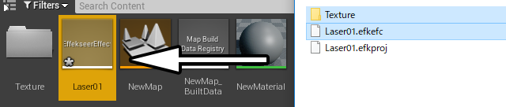

% EffekseerForUnrealEngine4

<div class="main">

## 概要

これはUnrealEngine4向けのEffekseerプラグインです。
このプラグインを使用すると、UnrealEngine4上でEffekseerで作成したエフェクトを再生できるようになります。

### 動作環境

#### バージョン

UnrealEngine4.16以降

#### コンパイラ

環境に合わせたコンパイラをインストールする必要があります。
例えば、WindowsではVisualStudio2015以降をインストールする必要があります。

#### プラットフォーム

プラットフォーム固有の機能は使用していないため、
EffekseerForUnrealEngine4はほとんどのプラットフォームで動作します。

## 構成

EffekseerForUE4では主に2つのコンポーネントで構成されています。

それは、```EffekseerSystemComponent``` と ```EffekseerEmitterComponent``` です。

EffekseerSystemはエフェクトの描画を行います。そのため、レベル内に必ず1つ必要です。

EffekseerEmitterComponentはエフェクトの生成や操作を行います。エフェクト1つ1つに必要です。

これらの他に、Effekseerのefkファイルに対応するアセットの```EffekseerEffect```と
Effekseerのefkmdlファイルに対応するアセットの```EffekseerModel```があります。

また、コンポーネントを使用しやすくした、```BP_EffekseerSystem``` と ```BP_EffekseerEmitter``` のブループリントもあります。

## サンプル

``` EffekseerForUE4.uproject ``` にサンプルのレベルが収録されています。

これを見るとEffekseerのエフェクトが再生されていることがわかります。


<div align="center">

</div>


## インストール・使用方法

ここでは、サンプル以外のプロジェクトでEffekseerForUE4をインストール・使用する方法について説明します。

### 1.1. ディレクトリのコピー

```Plugins``` のディレクトリをあなたが作成したuprojectと同じディレクトリにコピーします。

<div align="center">

</div>

### 1.2. C++のコードの追加

中身は空で問題ないので、何かしらのC++のコードをプロジェクトに追加します。

<div align="center">

</div>

<div align="center">

</div>


### 1.3. Plugin の有効化

UnrealEngine4からPluginを有効化します。再起動を求められる場合があるので、UnrealEngine4を再起動します。

<div align="center">

</div>

再起動した後にコンパイルを求められることがあります。プロジェクトをコンパイルします。

<div align="center">

</div>

### 1.4. ブループリントの追加

```BP_EffekseerSystem``` と ```BP_EffekseerEmitter``` をレベルに追加します。

これらはプラグインのコンテンツにあるので、プラグインのコンテンツを表示できるようにします。

<div align="center">

</div>

プラグインのコンテンツのディレクトリに移動します。

<div align="center">

</div>

ブループリントをレベルに追加します。

<div align="center">

</div>

現在、BP_EffekseerSystemは必ず、(0,0,0)の位置に配置する必要があります。

<div align="center">

</div>

BP_EffekseerEmitterはエフェクトを表示したい位置に配置します。

<div align="center">

</div>

### 1.5. アセットの追加

Effekseerから出力されたefkファイルとテクスチャをコンテンツに追加します。

<div align="center">

</div>

EffekseerEffectアセットにテクスチャを割り当てます。
EffekseerEffectアセットを右クリックした後、AssignResourcesを実行します。

<div align="center">

</div>

エフェクトが小さいことが多いので、EffekseerEffectアセットをダブルクリックしてスケールを設定します。
大きい数字を入力してエフェクトを見やすくしましょう。

<div align="center">

</div>

BP_EffekseerEmitterを選択して、コンポーネントを表示させます。
EffekseerEmitterコンポーネントのエフェクトに、先ほど読み込んだEffekseerEffectアセットを設定します。

<div align="center">

</div>

EffekseerEmitterコンポーネントのAuto ActivateをOnにします。

<div align="center">

</div>

実行すると、エフェクトが表示されるのがわかります。

<div align="center">

</div>

### 2.1. Effekseerのコンポーネント

他のアクターにEffekseerのコンポーネントを追加することもできます。
ただし、EffekseerSystemは複雑なので、EffekseerEmitterのコンポーネントのみ使用することをお勧めします。

<div align="center">

</div>


## 制限

乗算、減算、歪みはEffekseerでの表示と異なります。

モデルへの法線マップは適用されません。

## Todo

- 乗算、減算、歪みのEffekseerとUnrealEngine4の表示の一致

- モデルの法線の実装

- 使いやすさの向上

## ライセンス

<pre>

The MIT License (MIT)

Copyright (c) 2011 Effekseer Project

Permission is hereby granted, free of charge, to any person obtaining a copy of
this software and associated documentation files (the "Software"), to deal in
the Software without restriction, including without limitation the rights to
use, copy, modify, merge, publish, distribute, sublicense, and/or sell copies of
the Software, and to permit persons to whom the Software is furnished to do so,
subject to the following conditions:

The above copyright notice and this permission notice shall be included in all
copies or substantial portions of the Software.

THE SOFTWARE IS PROVIDED "AS IS", WITHOUT WARRANTY OF ANY KIND, EXPRESS OR
IMPLIED, INCLUDING BUT NOT LIMITED TO THE WARRANTIES OF MERCHANTABILITY, FITNESS
FOR A PARTICULAR PURPOSE AND NONINFRINGEMENT. IN NO EVENT SHALL THE AUTHORS OR
COPYRIGHT HOLDERS BE LIABLE FOR ANY CLAIM, DAMAGES OR OTHER LIABILITY, WHETHER
IN AN ACTION OF CONTRACT, TORT OR OTHERWISE, ARISING FROM, OUT OF OR IN
CONNECTION WITH THE SOFTWARE OR THE USE OR OTHER DEALINGS IN THE SOFTWARE.

</pre>

</div>


